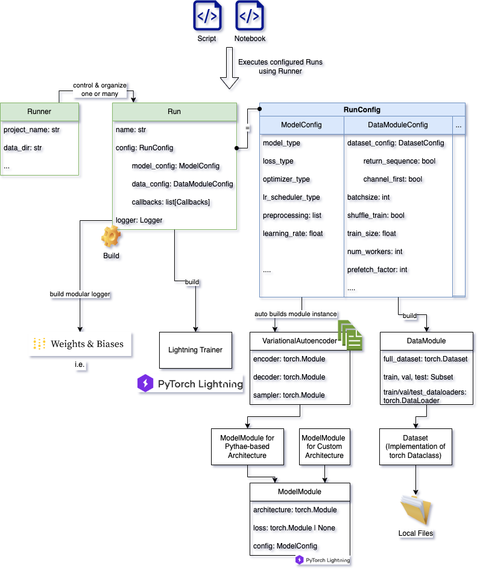

# Variational Autoencoder
**in Disentangled Representation Learning**

Clemens Kubach, Joanina Oltersdorff, Lukas Beinlich and Yilei Chen

Tutor: Monika

## Available Models
- Simple Residual VAE (SimpleResVAE)
- VAE with normalizing flows (NF-VAE)
- Very Deep VAE (VDVAE)
- Residual VAE (ResVAE - inspired by VDVAE)
- Advanced VAE (Adv-VAE)
- Sequential VAE (SeqVAE)
- Sequential VDVAE (SeqVDVAE)

## Prerequisites
- Install git lfs for downloading the saved checkpoints in selected-checkpoints directory

## Getting Started
1. Clone the repository
2. Install Python 3.10
3. Install Dependencies 
   - Run `pip install -r requirements.txt` to install all dependencies 
   - WandB account is optional but recommended
4. Goto repo root directory
5. Setup the dataset
   - Make sure you have the SIAR dataset available in `datafiles/`. 
   - For the time of reviewing, you can download it from [SIAR](https://drive.google.com/file/d/1r5JYUvPSP7j0O6GzjB5mMakD_CURLEJB/view?usp=sharing) and extract it to `datafiles/`.
   - An example path from the repository root to one image would look like the following: `datafiles/1/1.png`.
   - See section "Dataset" for further notes.
6. Make packages available to python 
   - Set env `export PYTHONPATH=$PYTHONPATH:$(pwd)`
7. Run experiments
   - Under `siar/experiments/` you can find scripts that you can use for doing experiments. 
   - For getting started easily, you can just run `python3 siar/experiments/simple_run_script.py` to train a predefined simple VAE. 
   - You can simply modify the configuration to your needs, like selecting different batch sizes, architectures, etc. 
   - Alternatively, you can also run our other run scripts in the folder for the different model types.


## Repository Structure

### Unitorchplate
The `unitorchplate` package contains a try of implementing a unified template for Pytorch experiments in the Computer Vision Domain.
The idea is to offer a baseline structure and functionality for your deep learning projects as Gradle is offering for software projects.
Every run is configurable via config classes/file to increase easy usability and reproducibility.
It is based on the framework Pytorch, Lightning and some ideas of mlflow.

While offering a standardized implementation for Lightning DataModules and Modules for Models (here named: ModelModules), it is saves time for getting started with a new project but also easily customizable via subclassing.
This project is a result of this semester's project and will be further developed in the future.

### Siar
The `siar` package implements this template for our specific use case and the SIAR dataset of this project.
For the model implementations, we built upon [Pythae](), a library for different autoencoder architectures for reconstructing input images.

## Dataset
You can also have the somewhere else, but then you have to change the path in the config in every run.
To make it easier, you can also make a softlink in the datafiles folder in the repository root directory to the folder where the dataset is located. 

Windows:
```
mklink /D "C:\<your-path-to-repo>\cvp2\datafiles" "C:\<your-path-to-dataset>\SIAR"
```
Unix:
```
ln -s <your-path-to-dataset>/SIAR <your-path-to-repo>/cvp2/datafiles
```

## Development

### Experiment Configs
In `siar/experiments/` you can find scripts that you can use for doing experiments.
Just change the parameters offered in the run config to your needs.

### Adding further models
You can orientate yourself on the already implemented models. The following files are relevant:

In `siar/models/architectures/`
- Define YourModelName in `your_model_name.py` for defining Encoder, Decoder, Architecture and Config.
For an example take a look at `simple_res_vae.py`.
- ModelTypes in `model_types.py` for registering your new architecture
- In `siar/experiments/` you can add a new experiment or just change the parameter in an already created run-script.

Optional:
- Look under `base_architectures` for some base architectures that you can use for your model or create a new one to customize the forward pass between encoder and decoder.

Note: The Pythae models only support reconstruction of the input image (self-reconstruction task).
That's why we had to override the forward function of their model classes (see VAE, NF-VAE).



## Papers
The references can be found in the project report.